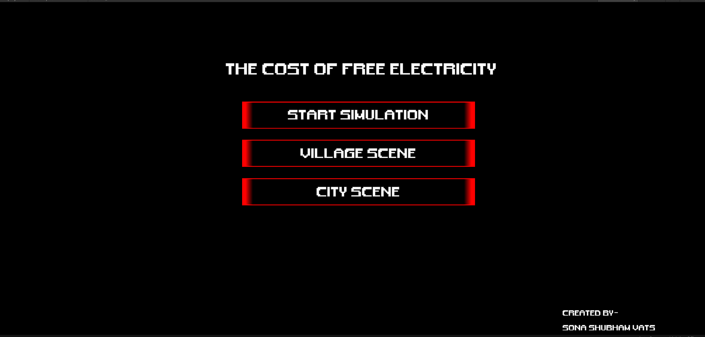
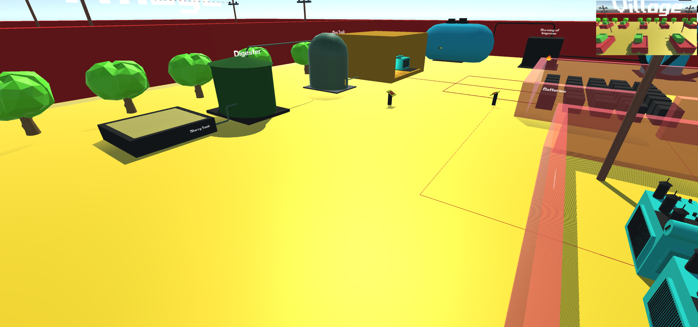
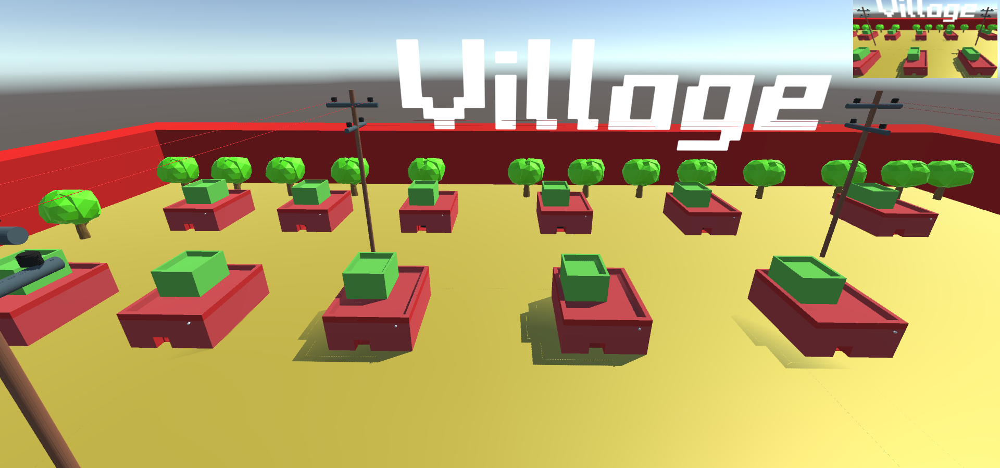
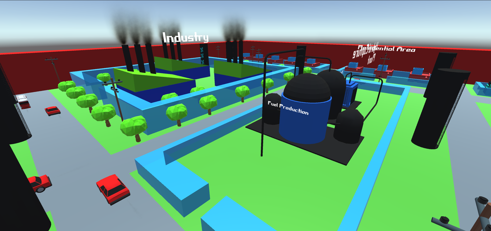
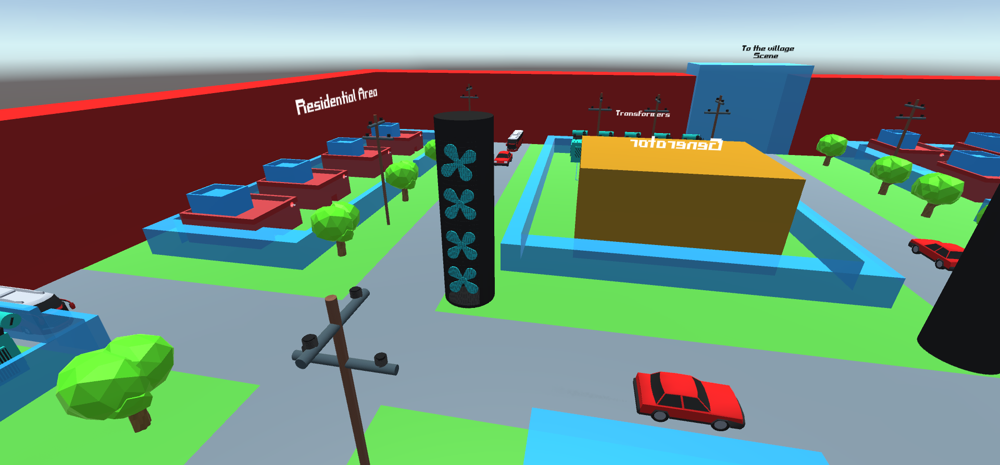

# Cost-of-Free-Electricity
A simulation depicting the ideas regarding the possible solutions to the "electricity problem" in India
**I used blender to create the 3d models and the environment for this game and I have used the game engine called -Unity to build the game**
I have made basically two scenes depicting the possible solutions that could work in a village and a city area.
 

 
The first village scene depicts a bio-fuel factory which uses crushed sugarcanes to generate electricity while the circuit is stabilize by adavanced lithium batteries.The simulation is completely inteteractable allowing the player to switch on or off all the functionalities of the electrivity plant
 

  
The second scene the city scene which features heavy turbines spread across the city directly taking in the polluted air and then using up the contaminants to generate electricity.
 

